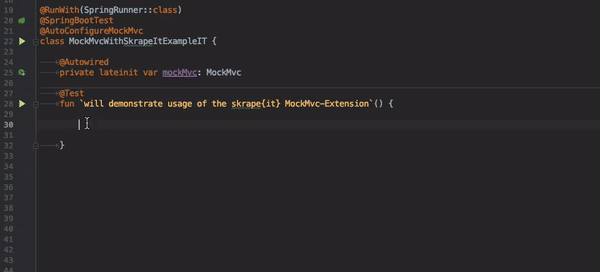

# MockMvc

### Setup


In order to use the MockMvc-extension it's required to have the [**skrapeit-core**](../../setup.md#getting-super-powers) artifact in the classpath as well as having a proper spring-test / spring-boot-test setup.





```markup
<dependency>
   <groupId>it.skrape</groupId>
   <artifactId>skrapeit-core</artifactId>
   <version>LATEST</version>
   <scope>test</scope>
</dependency>
<dependency>
   <groupId>it.skrape</groupId>
   <artifactId>skrapeit-mockmvc</artifactId>
   <version>LATEST</version>
   <scope>test</scope>
</dependency>
```





```kotlin
testCompile("it.skrape:skrapeit-core:+")
testCompile("it.skrape:skrapeit-mockmvc:+")
```




### How to Use

The [**skrape{it}**](../../) **MockMvc-extension** will extend MockMvc's `ResultActions` with an `andExpectHtml{}` lambda function. The scope of the lambda will give you a parsed response body \(deserialized to a `Doc`\) and enables you to make comfortable assumptions about the content, properties and structure of the document. 



